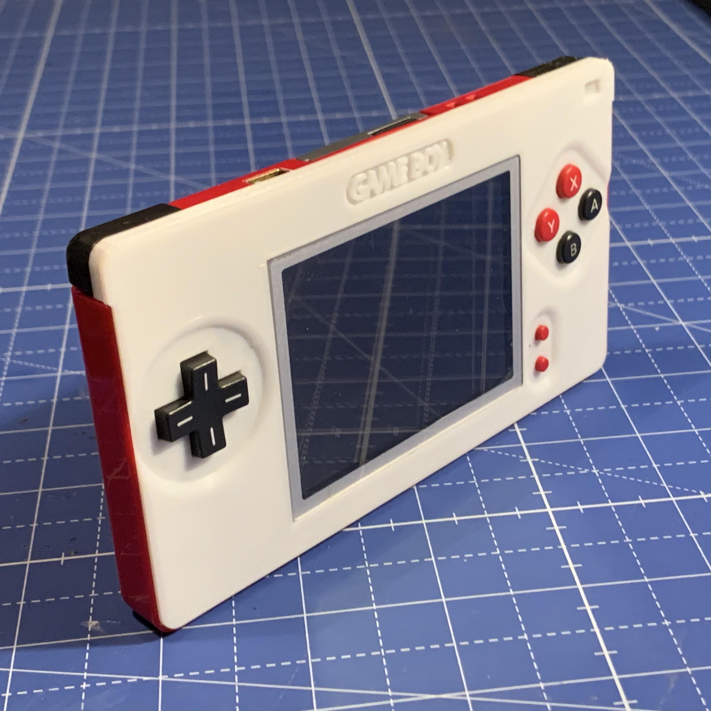
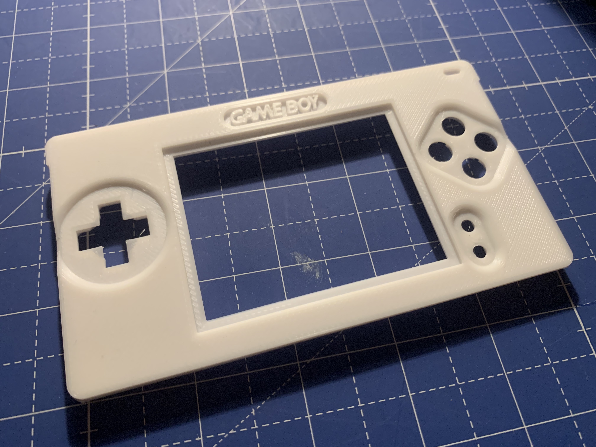
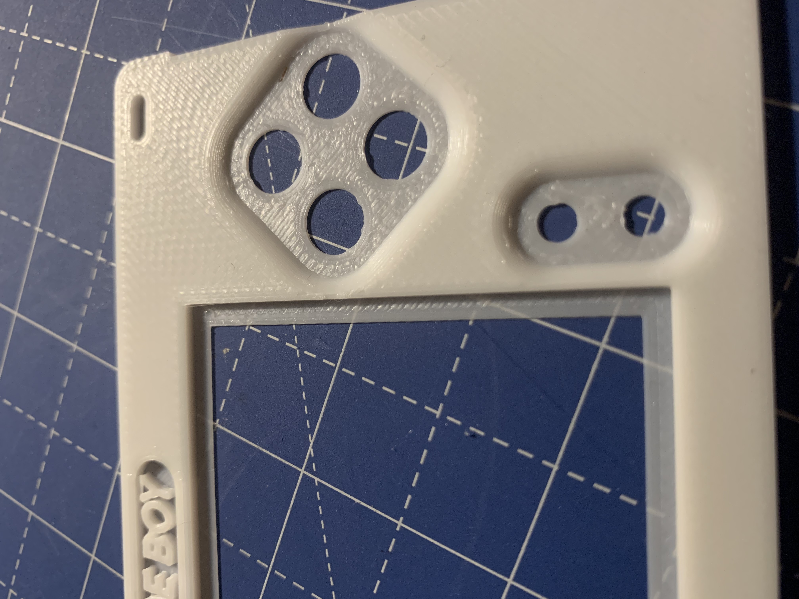
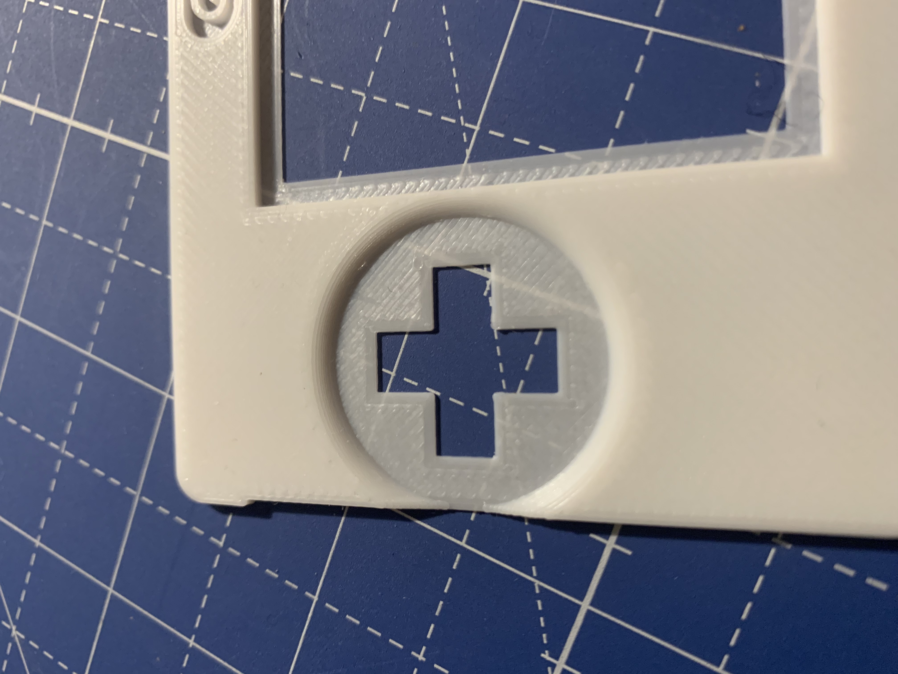
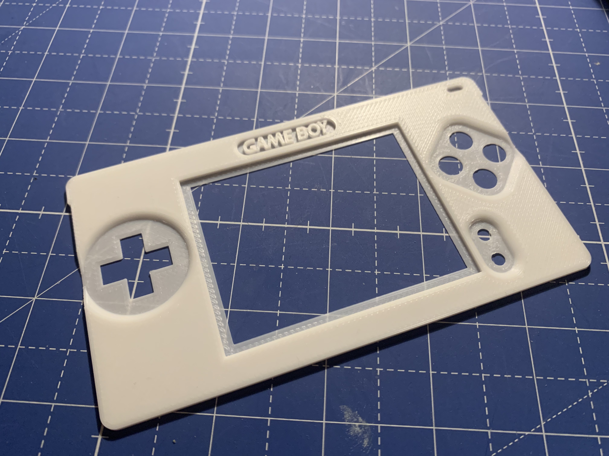
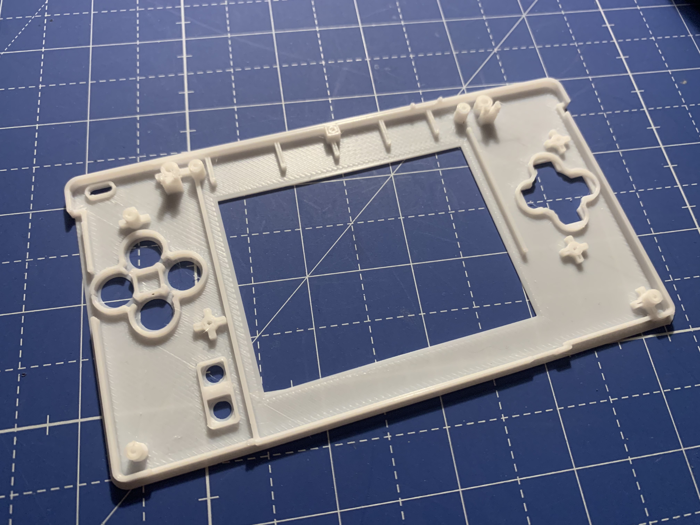
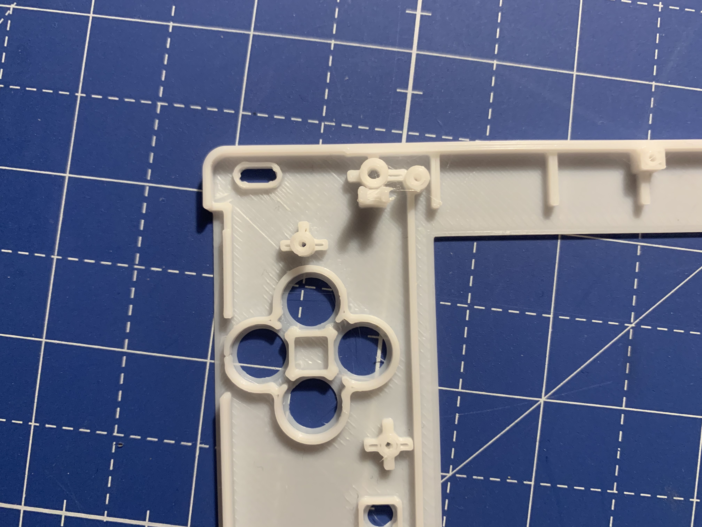
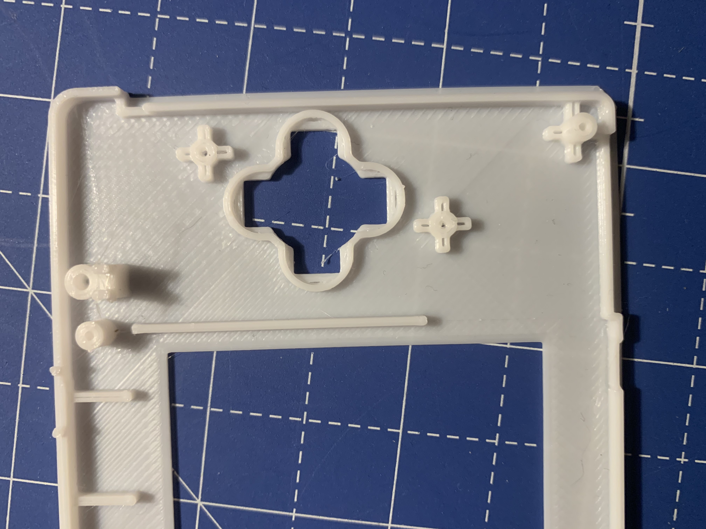

# Game Boy Macro - MK2
My MK2 version of a Gameboy Macro body / faceplate. 

This repo contains:
- STL files for 3D printing
- Fusion 360 f3d file
- printing instructions
- my goals and assembly instructions for additional information

</img>

This design is based on the upstream of this repository, please also see the original readme:
https://github.com/gb9k/GameboyMacro

## Github Stars
I do projects like this as a hobby in my free time for my own purpose - I have no commercial intentions.
I like the thought of open source, so I decided to not only share the STL files but also the source files for Fusion 360 for you to be able to adapt this to your own needs. 
If you like this project or even use it for your own remix, consider giving this repo a "star" to show your appreciation for my work. 

## buy me a coffee
This project exists only because I had a particular idea that I wanted to realise. Because of the positive feedback I got I decided to open source it, and this is a lot of additional work. 
If you can contribute or you want to, feel free to do it at [Buy me a coffee! ☕](https://buymeacoff.ee/harryurban), I will be really thankfull for anything even if it is a coffee or just a kind comment towards my work, because that helps me a lot.
Be careful and donate just if it is within your possibilities, because there is no refund system.
And remember that you don't need to donate, it is just a free choice for you.
Thank you!

## Photos of printed parts
| part      | description                            | photo                                  |
|-----------|----------------------------------------|----------------------------------------|
| face+back | glued together                         |        |
| face      | indent for ABXY and start/select       |  |
| face      | indent for D-Pad                       |            |
| face      | full view of the face                  |            |
| back      | full view of the back                  |           |
| back      | led hole and screw hole reinforcements |       |
| back      | inner dpad with reinforcements                 |           |

## Goals of the design
- Game Boy logo
- smooth transitions from all button indents to the top face (edge fillets)
- a recessed frame using the top screen plastic lense as a cover for the display, because it is unprotected without having the touch screen attached
- Full screen sized cutout in order to accomodate the entire display. (I use it with an R4-sdhc card so I wanted see all of the menus)
- .2 mm / 2 layers at the led "hole" to still see it but not fearing water or debris getting in

## Printing instructions
The body is split in two parts because it would be hard to impossible to get a clean result by using support structures.

### Face part
- print with `.15` or `.1` layer height

### Back part
- `.2` layer height is enough
- `2-3` outlines 
- I think I went with .5 line width, but please check in the slicer preview if all of the important lines are printed only as lines to give good structural support and clean outlines
- get your retraction settings right to avoid stringing and manual cleanup afterswards

### Assembly
- glue parts together with superglue, or what you works best for the material you use
